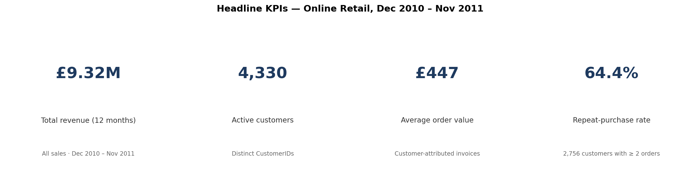
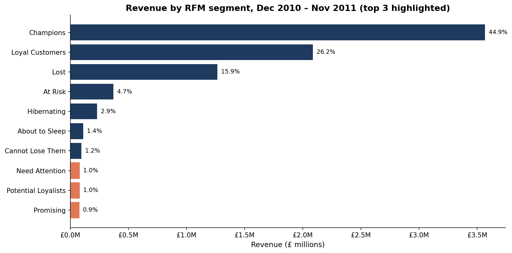
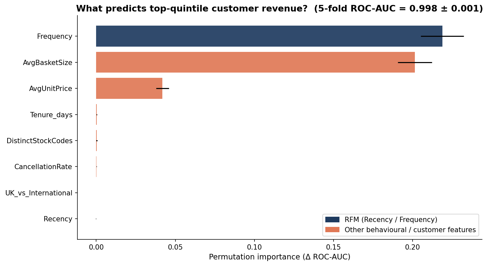
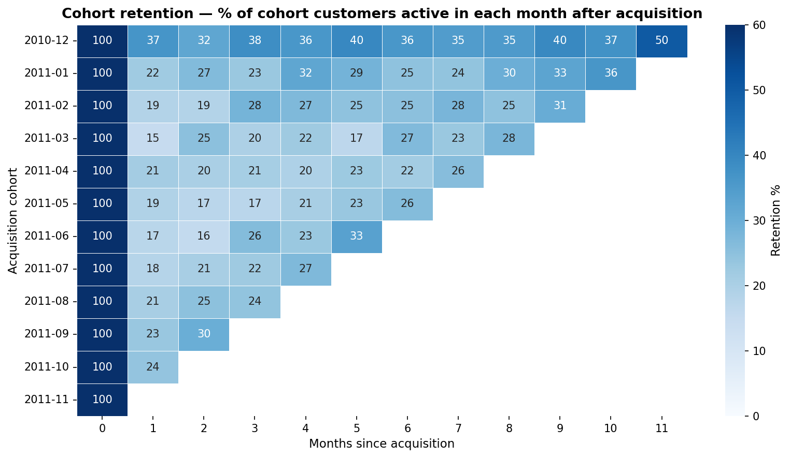
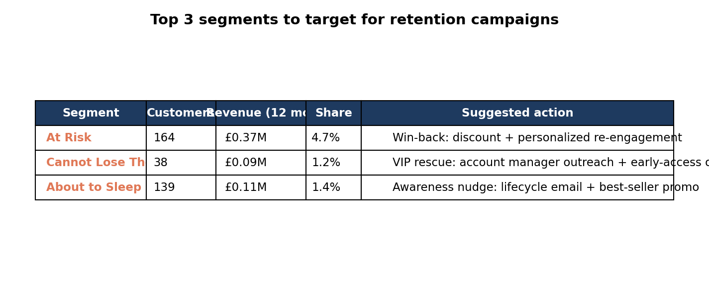

# Investigating Retail Data — Who Drives Revenue, and Who's Slipping Away?

[](https://www.python.org/)
[](https://pandas.pydata.org/)
[](https://numpy.org/)
[](https://scikit-learn.org/)
[](https://jupyter.org/)
[](https://matplotlib.org/)
[](https://seaborn.pydata.org/)
[](https://developer.mozilla.org/en-US/docs/Web/HTML)
[](https://developer.mozilla.org/en-US/docs/Web/CSS)
[](https://github.com/)

🔗 **[View the live report →](https://j-amores.github.io/DA-Retail-Transaction-Analysis/)**

## Overview

End-to-end customer-analytics study on the UCI Online Retail dataset — ~541,000 transactions from a UK gifts-and-homewares retailer over December 2010 – December 2011. The project segments the customer base via RFM scoring (Recency, Frequency, Monetary) on the standard Putler 11-segment grid, tracks monthly cohort retention, and trains an interpretable model for the behavioural drivers of high lifetime value, then surfaces a focused retention play.

**Central Finding:** *Champions* and *Loyal Customers* — 1,282 customers, 30% of the base — account for **71% of the £9.32M annual revenue**. Meanwhile month-1 cohort retention has slipped from **36.6% in the December 2010 cohort to 15.0% by March 2011** and never recovers. The highest-leverage move is targeted retention spend on the 341 customers in *At Risk*, *Cannot Lose Them*, and *About to Sleep* — a small pool but **£574k of revenue at stake**.

## Project Structure

```
DA-Retail-Transaction-Analysis/
├── README.md
├── requirements.txt
├── index.html                                # Stage 3: self-contained editorial HTML report
├── notebooks/
│   ├── analysis.ipynb                        # Stage 1: 5-stage EDA + RFM + cohort + LTV pipeline
│   └── final-report.ipynb                    # Stage 2: narrative report (5-question structure)
├── scripts/
│   ├── build_pipeline.py                     # End-to-end pipeline (regenerates charts + processed CSVs + summary.json)
│   ├── make_notebook.py                      # Builds notebooks/analysis.ipynb from build_pipeline.py
│   ├── make_report_notebook.py               # Builds notebooks/final-report.ipynb from summary.json
│   └── make_index.py                         # Builds index.html from the editorial-report template + summary.json
├── data/
│   ├── raw/                                  # Online Retail.xlsx (gitignored — see Note below)
│   └── processed/
│       ├── online_retail_clean.csv           # Cleaned line items (508,937 rows)
│       ├── online_retail_analysis.csv        # Per-customer feature frame (4,279 customers × 19 cols)
│       ├── rfm_segment_map.json              # (R, F, M) score-triple → segment mapping (125 triples)
│       └── summary.json                      # KPIs, cleaning log, segment table, cohort, LTV — single source of truth for both reports
└── charts/
    ├── A1_data_overview.png                  # Validation: monthly volume, top countries, cardinalities, quality flags
    ├── A2_missingness.png
    ├── B1_revenue_over_time.png              # Profile: monthly net revenue
    ├── B2_country_distribution.png
    ├── B3_qty_unitprice_dist.png
    ├── B4_invoice_size_dist.png
    ├── B5_returns_vs_purchases.png
    ├── E1_q1_size_kpis.png                   # Q1 — headline KPIs (4-panel)
    ├── E2_q2_segment_revenue.png             # Q2 — revenue by segment
    ├── E3_q3_ltv_feature_importance.png      # Q3 — LTV-driver feature importance
    ├── E4_q4_cohort_heatmap.png              # Q4 — cohort retention heatmap
    ├── E5_q5_target_segments.png             # Q5 — three retention-target segments
    ├── S1_cohort_retention_lines.png         # Supplementary
    ├── S2_ltv_pdp_top1.png
    ├── S3_ltv_pdp_top2.png
    └── S4_segment_customer_count.png
```

> **Note:** The raw `data/raw/Online Retail.xlsx` (~23 MB) is gitignored to keep
> the repo small. Download it from the
> [UCI Online Retail dataset page](https://archive.ics.uci.edu/dataset/352/online+retail)
> and place it at `data/raw/Online Retail.xlsx` to re-run the pipeline from
> scratch. The processed CSVs and `summary.json` are committed, so the report
> notebook and HTML site work without the raw file.

## Dataset

| Property | Detail |
|----------|--------|
| **Source** | [UCI Machine Learning Repository — Online Retail](https://archive.ics.uci.edu/dataset/352/online+retail) (Daqing Chen, 2015 · CC BY 4.0) |
| **Domain** | UK-based gifts and homewares retailer (B2B-leaning order book) |
| **Period** | 2010-12-01 → 2011-11-30 (12 full months — trailing 9 days of Dec 2011 trimmed for clean cohort math) |
| **Raw Size** | 541,909 rows × 8 columns across 38 countries |
| **Cleaned Size** | 508,937 line items |
| **Customers Retained** | 4,279 customers (after netting cancellations and removing all-cancellation accounts) |
| **Currency** | GBP (£) — labelled on every monetary axis |

**Schema:** `InvoiceNo`, `StockCode`, `Description`, `Quantity`, `InvoiceDate`, `UnitPrice`, `CustomerID`, `Country`.

## Data Processing

- **Period trim:** restricted to 2010-12-01 → 2011-11-30 (12 full months); 25,525 rows dropped.
- **Quality drops:** `UnitPrice ≤ 0` removed (2,463 rows); exact duplicates removed (4,984 rows).
- **Cancellations:** kept and **netted** against per-customer revenue rather than dropped wholesale (8,892 rows).
- **Customer-level frames:** rows missing `CustomerID` (~25%) kept for total revenue but dropped for RFM, LTV, and cohort analyses.
- **RFM scoring:** independent quintile bins on R, F, M; (R, F, M) score triples mapped through the standard Putler 11-segment grid (Champions → Lost).
- **LTV-driver model:** `HistGradientBoostingClassifier` predicting top-quintile net Monetary (threshold £1,920) from 8 features; reported with 5-fold stratified CV plus permutation importance.
- **Cohort retention:** monthly first-purchase cohorts; unobserved cells masked grey to avoid the false-trend pitfall.

## Project Includes

- 16 production charts: 2 validation (`A#`), 5 exploratory (`B#`), 5 question-anchor (`E#`), 4 supplementary (`S#`).
- Auditable RFM scoring with full (R, F, M) → segment mapping exported as JSON.
- Per-customer feature frame (4,279 × 19) ready for downstream modelling.
- Interpretable LTV-driver model with permutation importance and partial-dependence plots for the top non-RFM features.
- Triangular cohort-retention heatmap with proper masking of unobserved windows.
- Self-contained editorial HTML report with animated KPI counters, scroll reveals, dark-mode toggle, and a CSS-native bar chart for segment-revenue share.

## Summary

### Problem Statement

The UCI Online Retail dataset captures a year of UK e-commerce activity but
offers no segmentation, no retention view, and no driver analysis out of the
box. This project asks five questions of the data — sized for a CRM and
marketing audience — to identify *who carries the revenue, who is slipping
away, and where the next pound of retention spend should go.*

---

### Q1 — What is total revenue, AOV, and repeat purchase rate?



The retailer turned over **£9.32M across 4,330 distinct customers** in 12 months, with an average order value of **£447** per invoice and a **64.4% repeat-purchase rate** (2,756 customers placed two or more orders). The AOV is well above a typical consumer e-commerce basket, consistent with a B2B-leaning order book.

---

### Q2 — Which customer segments contribute the most revenue?



A single segment — **Champions, 511 customers (~12% of the base)** — contributes **£3.57M, or 44.9%** of total customer-attributed revenue. Adding **Loyal Customers** (771 customers, £2.09M, 26.2%) brings the top two segments to **71% of revenue from 30% of the base** — a textbook Pareto and the structural fact behind every recommendation.

---

### Q3 — Which factors predict high lifetime value?



A gradient-boosted classifier predicts top-quintile spend with **95.6% precision and 95.3% recall**. Beyond the expected dominance of purchase Frequency, the strongest **non-RFM** lever is **average basket size** (importance ≈ 0.201) — meaningfully more important than average unit price (0.042). The implication: bundles and free-shipping thresholds beat premium-SKU pushes for converting customers into the top tier.

---

### Q4 — Are newer customers staying with us as well as older ones?



The first cohort (December 2010) retains **36.6%** of customers at month +1; the worst cohort (March 2011) drops to **15.0%**, less than half. **No later cohort recovers the December baseline.** Topline revenue grew across the year, so the business looks healthy on the headline — but the cohort view shows a chunk of that growth is coming from less sticky customers, a warning rather than a victory.

---

### Q5 — Which 3 segments should we target for retention campaigns?



*At Risk*, *Cannot Lose Them*, and *About to Sleep* together hold **341 customers (8% of the base) and £574k of revenue (7.2% of the total)** — small enough to act on with focus. The three pools warrant three intensities: **1:1 outreach for *Cannot Lose Them*** (38 customers, £2,470 each on average), a **discount-led win-back for *At Risk*** (164 customers, £370k of revenue), and a **lifecycle nudge for *About to Sleep*** before they migrate further down.

## Technologies Used

- **Python** — pandas, numpy, scikit-learn (`HistGradientBoostingClassifier`), matplotlib, seaborn, openpyxl
- **Jupyter Notebook** — Reproducible analytical pipeline (47-cell EDA + 29-cell narrative report)
- **HTML/CSS** — Self-contained editorial report with scroll reveals, animated KPI counters, dark-mode toggle, and a CSS-native bar chart

## How to Run

```bash
# 1. Set up the environment
python3 -m venv .venv
source .venv/bin/activate
pip install -r requirements.txt

# 2. Place the raw dataset
#    Download Online Retail.xlsx from https://archive.ics.uci.edu/dataset/352/online+retail
#    and save it to data/raw/Online Retail.xlsx

# 3. Run the end-to-end pipeline (regenerates charts/, data/processed/, summary.json)
python scripts/build_pipeline.py

# 4. Rebuild the notebooks and the HTML report from the pipeline outputs
python scripts/make_notebook.py            # → notebooks/analysis.ipynb
python scripts/make_report_notebook.py     # → notebooks/final-report.ipynb
python scripts/make_index.py               # → index.html

# 5. Open the report
open index.html
```

Alternatively, open `notebooks/analysis.ipynb` and `notebooks/final-report.ipynb` directly in Jupyter and run all cells.

## Conclusion

This project demonstrates that a UK retailer's apparently healthy headline numbers (£9.32M revenue, 64% repeat rate) hide a sharp structural concentration: **30% of customers carry 71% of revenue**, and acquisition quality is degrading even while topline grows. The interpretable LTV-driver model identifies **average basket size** as the strongest behavioural lever beyond raw frequency, pointing to bundles and free-shipping thresholds as the cleaner growth play than premium-SKU pushes. The recommended near-term action is a focused, three-tier retention campaign on 341 customers carrying £574k of revenue — a small, sharp, ready-to-execute play rather than a mass-marketing programme.

## Author

- **John**
- [GitHub](https://github.com/J-Amores)
